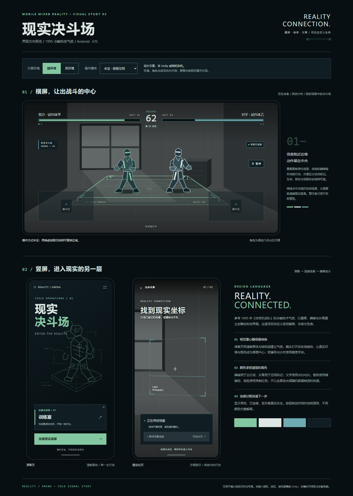

# Utopia-UI-design

面向 Unity 6、Android 与 iOS 手机 MR 决斗游戏的界面设计复用包。

视觉参考来自项目提供的攻壳主题赛事海报：黑黄配色、中文衬线标题、切角细框与机械线稿。竖屏用于准备和重定位，横屏用于现实场景中的决斗；具体操作方式保留为可替换模块。

- [使用说明](START-HERE.md)
- [Agent Skill](skills/utopia-mr-ui/SKILL.md)：使用时复制整个 `utopia-mr-ui` 目录。
- [可复制提示词](prompts/unity-ui-agent.md)
- [设计变量](skills/utopia-mr-ui/assets/design-tokens.json)
- [完整复用包](dist/utopia-mr-ui-kit.zip)
- [验证记录](docs/validation.md)

将仓库下载到本地后，用浏览器打开 [界面预览](docs/design-preview.html)，可以切换明暗示意环境和候选操作模块。GitHub 文件页展示的是 HTML 源码。

当前产物为设计规范与预览，未接入相机、重定位或游戏逻辑，未通过 Unity Editor 与 Android/iPhone 真机验收。参考海报用于说明视觉依据，不是已经制作完成的客户端 UI 资源。
